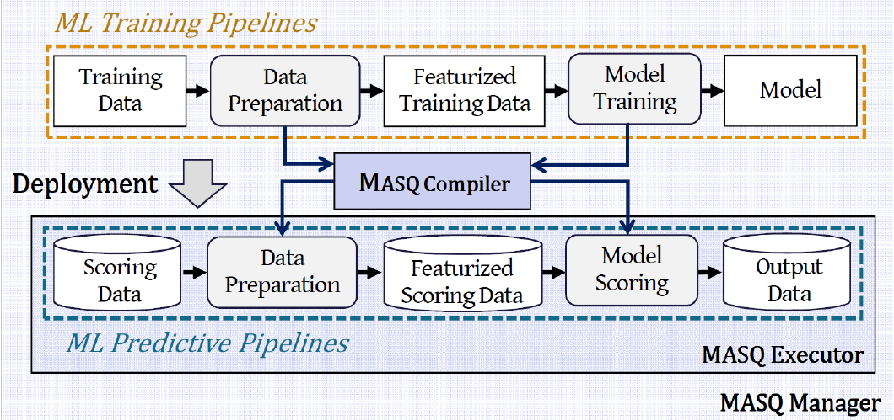

# MASQ 
*MASQ* is a framework able to run inference of ML models
directly on DBMSs. *MASQ* not only averts expensive data movements for those predictive 
scenarios where data resides on a database,
but it also naturally exploits all the “Enterprise-grade” features such
as governance, security and auditability which make DBMSs the
cornerstone of many businesses. *MASQ* compiles trained models
and ML pipelines implemented in scikit-learn directly into standard
SQL: no UDFs nor vendor-specific syntax are used, and therefore
queries can be readily executed on any DBMS.

Currently, you can use *MASQ* to convert your trained traditional ML models into SQL query. 
*MASQ* supports a variety of classifiers and regressors. These models include
[scikit-learn](https://scikit-learn.org/stable/) Gradient Boosting Classifier, 
Regressor and Logistic Regression. 

Support for other models and neural network backends is on our roadmap.

## Framework




Frontend GUI available at [MASQ_frontend](https://github.com/FrancescoDelBuono/MASQ_frontend)


## Installation

*MASQ* was tested on Python >= 3.5 on Linux, Windows and MacOS machines.  
It is recommended to use a virtual environment 
(See: [python3 venv doc](https://docs.python.org/3/tutorial/venv.html)).

Clone the project into local

Install the MASQ package:
```bash
$ pip install -r requirements.txt
```

## Running the Django API in local

Run the Django command-line 
utilities to create the database tables automatically:

```bash
$ python manage.py makemigrations
$ python manage.py migrate
```

In order to run the application type the following command

```bash
$ python manage.py runserver
```

The Application Runs on **localhost:8000** 

## License
[MIT License](LICENSE)


